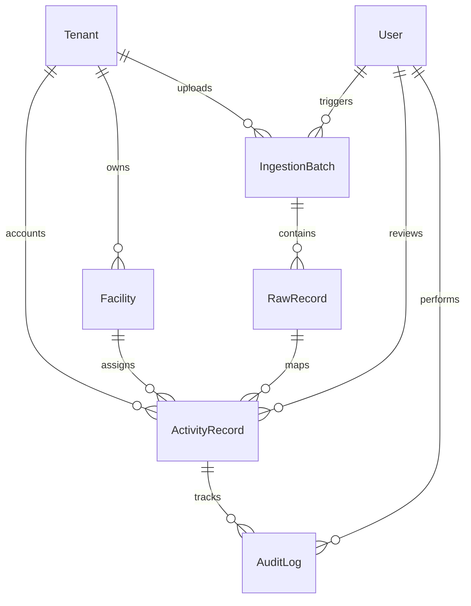

# Breathe ESG - Data Model Design (MODEL.md)

This document provides a detailed breakdown of the Breathe ESG data schema and explains the design decisions made to support multi-tenancy, Scope 1/2/3 categorization, source-of-truth lineage, unit normalization, and audit compliance.

---

## Entity-Relationship Diagram (ERD)



---

## Model Schemas and Fields

### 1. Multi-Tenancy Design
To enforce clean logical isolation between client companies (multi-tenancy), every primary table (`Facility`, `IngestionBatch`, and `ActivityRecord`) carries a direct Foreign Key relation to the `Tenant` table. All backend API queries are automatically scoped by `tenant_id` to prevent cross-tenant data leakage.

#### `Tenant`
Stores client company identifiers:
*   `id` (BigAuto): Primary key.
*   `name` (Char): Client company name (e.g. "Breathe ESG Enterprise Demo").
*   `created_at` (DateTime): Organization signup date.

#### `Facility`
Stores physical locations or meter assets, mapped to raw identifiers:
*   `id` (BigAuto): Primary key.
*   `tenant` (FK -> Tenant): Tenant partition ownership.
*   `name` (Char): Facility display label (e.g., "San Francisco Corporate HQ").
*   `facility_code` (Char): Code used by source systems (e.g., SAP plant code `WERKS-1001` or ConEd meter ID `CONED-4210`).
*   `region` (Char): Regional grid location to determine grid subregion emission factors (e.g., `US-WEST`, `DE-NORTH`).

---

### 2. Source-of-Truth Tracking & Lineage
To satisfy audit standards, a normalized record must never become disconnected from the raw file that produced it. Our lineage architecture isolates raw imports from normalized structures:

#### `IngestionBatch`
Tracks history of every ingested file feed:
*   `id` (BigAuto): Primary key.
*   `tenant` (FK -> Tenant): Tenant partition.
*   `source_type` (Char): Choice of `'SAP'`, `'UTILITY'`, or `'TRAVEL'`.
*   `file_name` (Char): Filename of the imported feed.
*   `status` (Char): Ingestion outcome: `'PENDING'`, `'PROCESSING'`, `'SUCCESS'`, `'FAILED'`.
*   `uploaded_at` (DateTime): Timestamp of upload.
*   `uploaded_by` (FK -> User): Identity of the analyst who triggered ingestion.
*   `total_rows`, `processed_rows`, `failed_rows` (Integer): Row processing statistics.
*   `error_summary` (Text): Exposes first 20 parser errors if ingestion failed.

#### `RawRecord`
The verbatim source-of-truth locker:
*   `id` (BigAuto): Primary key.
*   `batch` (FK -> IngestionBatch): Lineage back to file upload batch.
*   `row_index` (Integer): Row position in original CSV.
*   `raw_payload` (JSONField): The exact, unedited original CSV row stored as a JSON object (guarantees a permanent audit trail back to source files).
*   `status` (Char): `'UNPROCESSED'`, `'VALIDATED'`, `'ERROR'`.
*   `error_message` (Text): Specific parsing error if row validation failed.

---

### 3. Normalized ESG Ledger (Activity Ledger)

#### `ActivityRecord`
The primary ESG emissions ledger. This unified table accommodates Scope 1, 2, and 3 entries in a single queryable format, with fields to preserve original units while holding normalized equivalents:
*   `id` (BigAuto): Primary key.
*   `tenant` (FK -> Tenant): Multi-tenant partition.
*   `facility` (FK -> Facility, optional): Association to physical asset.
*   `raw_record` (FK -> RawRecord, optional): Preserves the direct Foreign Key link to the original `RawRecord` JSON, providing absolute lineage.
*   `source_type` (Char): Origin feed system (`SAP`, `UTILITY`, `TRAVEL`).
*   `scope` (Integer): Choice of `1` (Direct Fuel), `2` (Electricity), or `3` (Travel/Procurement).
*   `category` (Char): Detailed category label (e.g., "Purchased Electricity (Location-based)", "Business Travel Flight").
*   `activity_date` (Date): Represents start of activity. For calendar-split billing cycles, represents month start (e.g., 2026-01-01).
*   `end_date` (Date, optional): End of activity period.
*   `original_quantity` (Decimal): Messy quantity as imported (e.g., 100).
*   `original_unit` (Char): Messy unit as imported (e.g., `GAL`).
*   `quantity` (Decimal): Converted, standardized quantity (e.g., 378.541).
*   `unit` (Char): Standardized SI base unit (e.g., `L` for liquid fuels, `kWh` for electricity, `pkm` for flight mileage, `KG` for solid materials).
*   `co2e_emissions` (Decimal): Recalculated total metric tons of carbon dioxide equivalent ($t\text{ CO}_2\text{e}$). Calculated as:
    $$\text{Emissions } (t\text{ CO}_2\text{e}) = \frac{\text{Normalized Quantity} \times \text{Emission Factor} \times \text{Flight Multiplier (optional)}}{1000}$$
*   `emission_factor_used` (Decimal): Standard factor coefficient at calculation time.
*   `status` (Char): Review states: `'PENDING_REVIEW'`, `'APPROVED'`, `'REJECTED'`.
*   `reviewed_by` (FK -> User, optional): Analyst who approved/rejected row.
*   `reviewed_at` (DateTime, optional): Sign-off timestamp.
*   `rejection_reason` (Text, optional): Logged audit justification if rejected.
*   `is_edited` (Boolean): Flagged `True` if manual overrides corrected the normalized row.
*   `anomaly_flags` (JSONField): Logged validation flags (e.g. `{"usage_spike": true}`, `{"unmapped_plant": true}`).

#### `EmissionFactor`
Standard carbon lookup tables:
*   `id` (BigAuto): Primary key.
*   `source_type` (Char): `'SAP'`, `'UTILITY'`, `'TRAVEL'`.
*   `category` (Char): Component name (e.g., "Diesel Fuel", "Short-Haul Flight").
*   `scope` (Integer): Scope classification.
*   `factor` (Decimal): Coefficient weight ($kg\text{ CO}_2\text{e}$ per base unit).
*   `unit` (Char): Target standard base unit.
*   `region` (Char, optional): Grid-specific subregion to map grid intensity (e.g., `US-WEST`).
*   `active` (Boolean): Enables versioning control.

---

### 4. Immutable Audit Trail

#### `AuditLog`
An immutable log capturing every manual override, approval, or rejection. A row in `ActivityRecord` is linked to a chronological list of modifications:
*   `id` (BigAuto): Primary key.
*   `activity_record` (FK -> ActivityRecord): The target activity row being tracked.
*   `user` (FK -> User): Identity of the analyst who performed the operation.
*   `action` (Char): Choice of `'CREATE'` (Initial Import), `'UPDATE'` (Override), `'APPROVE'` (Locked sign-off), `'REJECT'`.
*   `timestamp` (DateTime): Automatic timestamp.
*   `changes` (JSONField): Captures a key-value diff of old values vs. new values. E.g.:
    ```json
    {
      "quantity": {
        "old": "378.54",
        "new": "320.00"
      },
      "co2e_emissions": {
        "old": "1.014",
        "new": "0.857"
      }
    }
    ```
